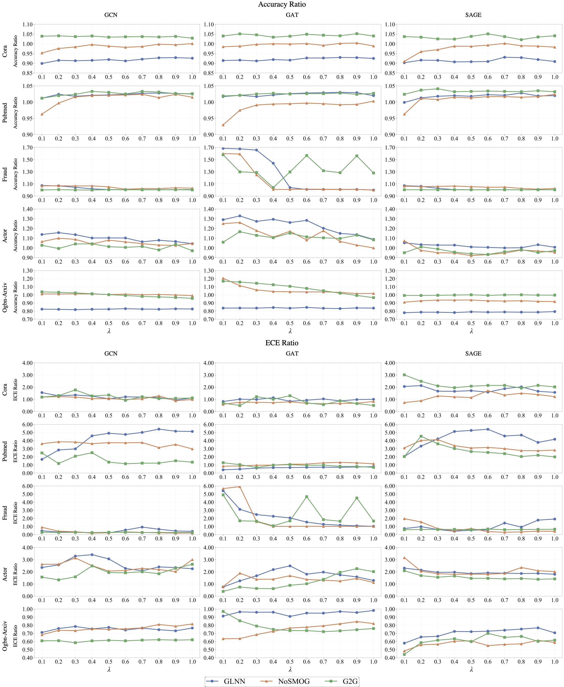
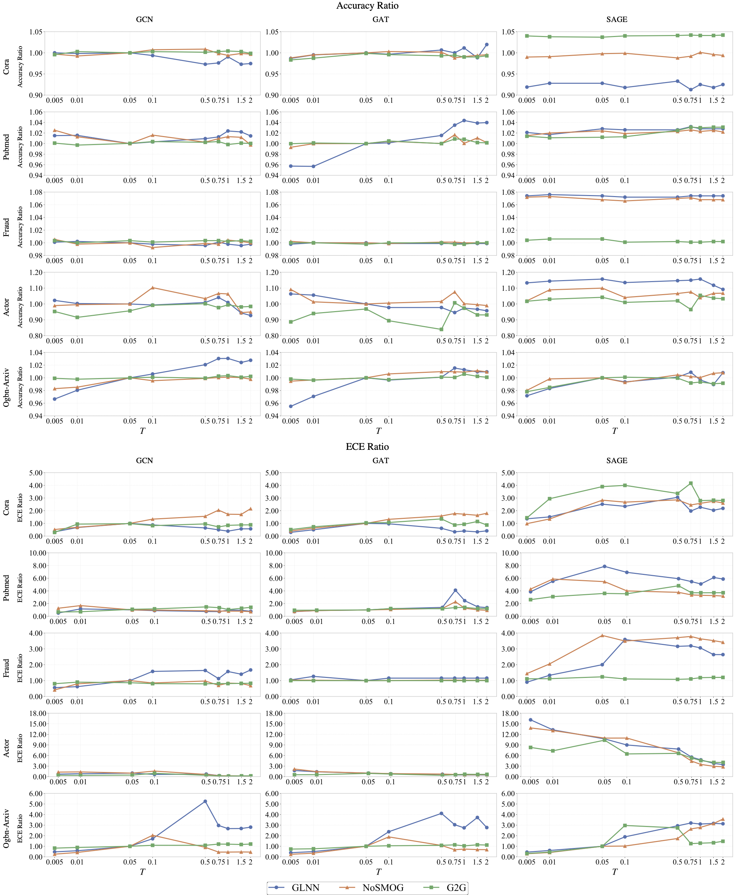
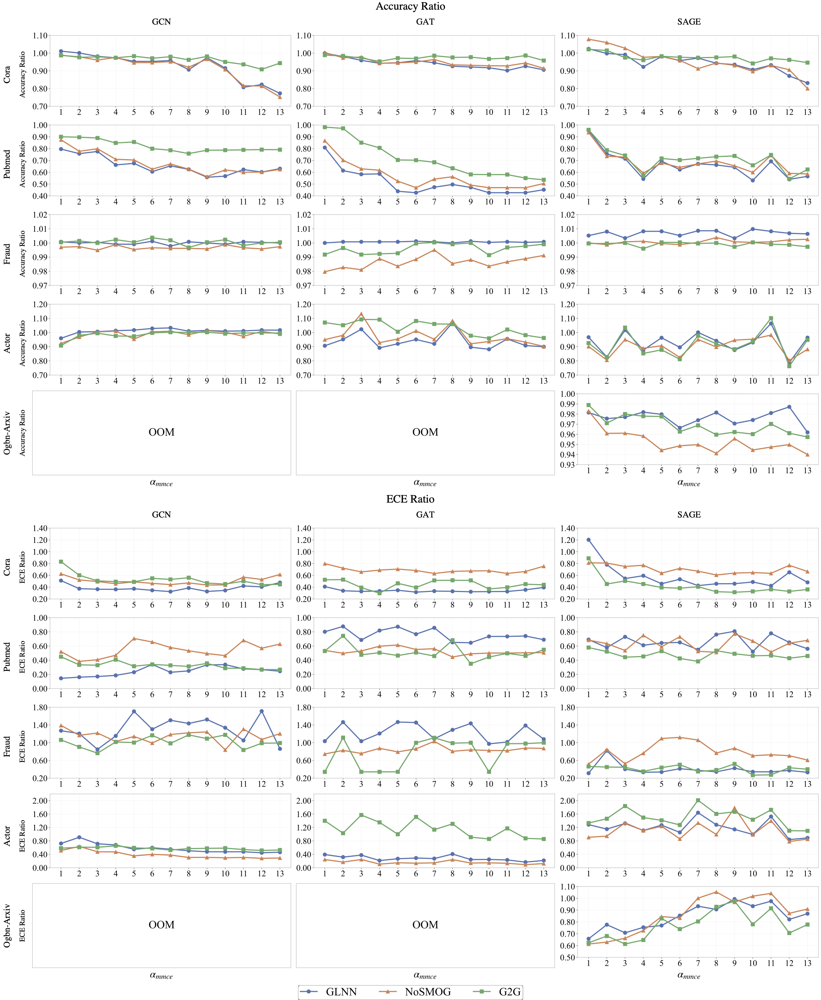
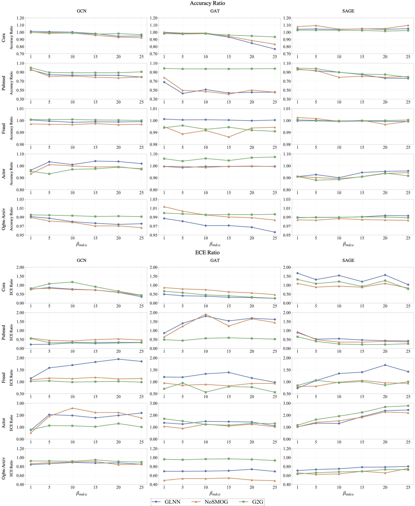
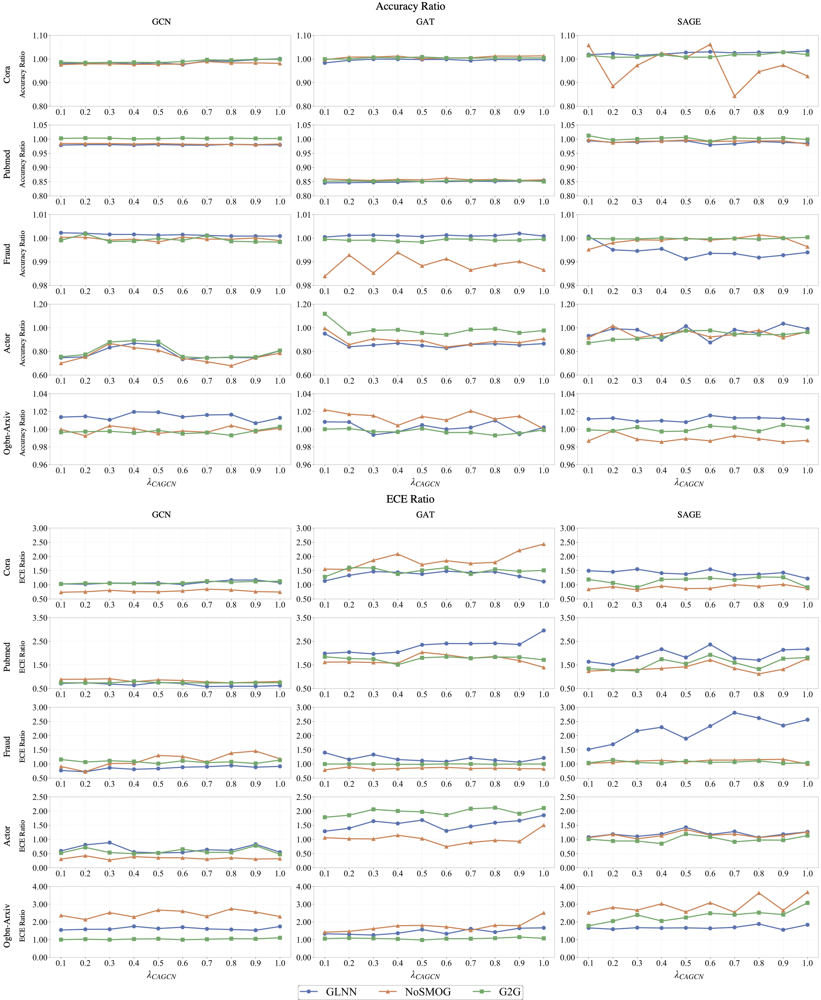
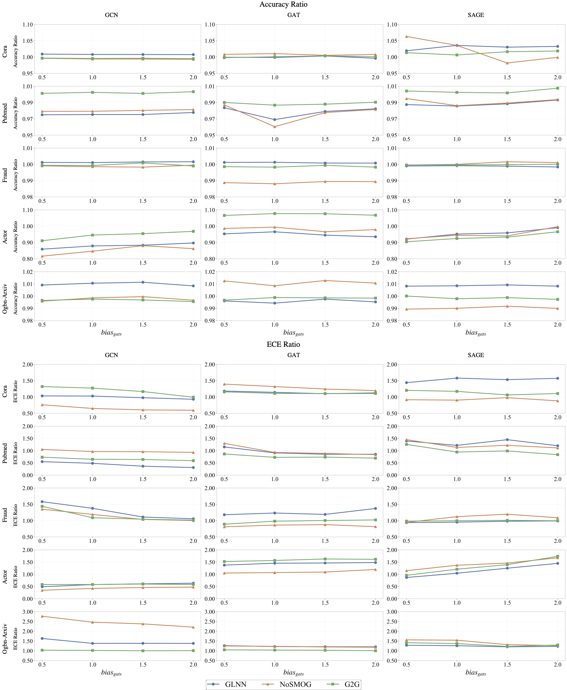

# Calibration-Aware Graph Distillation: Pitfalls, Challenges, and an Empirical Study

> Investigating the interplay between model calibration and knowledge distillation in Graph Neural Networks (GNNs).

---

## Paper Abstract

Graph Neural Networks (GNNs) have achieved remarkable success in modeling complex relational data. However, their deployment in resource-constrained real-world settings is challenging due to high inference costs and latency. Knowledge distillation addresses this by transferring information from large teacher models to compact student models. However, teacher GNNs often remain poorly calibrated, resulting in unreliable confidence scores. Knowledge distillation, on the other hand, reshapes the student’s decision boundaries and uncertainty estimates. The interplay between distillation and calibration in the context of graphs remains unexplored, despite both being extensively studied independently. This study provides the first comprehensive analysis of how teacher calibration influences student performance in graph knowledge distillation. We systematically examine five calibration techniques across three representative distillation paradigms on five benchmark datasets with varying properties. Extensive experiments are performed on diverse benchmarks under varied calibration strategies, hyperparameters, and dataset characteristics. Broadly, we observe that improvements in calibration can come at the expense of accuracy, the trade-off which standard evaluation frameworks struggle to capture. Hence, to handle this tradeoff, we also propose a metric to select effective GNN distillation strategy across diverse calibration settings to enable reliable predictions.

---

## Research Questions

This paper aims to answer the following questions:

- How does the strength of distillation impact the calibration transfer?
- How does the choice between post-hoc vs. during-training calibration affect the knowledge transfer during distillation?
- Are graph-specific calibration methods essentially better during distillation?
- How do different types of distillation method affect the transfer of calibration?

---

## Key Contributions

### 1. First Systematic Study of Calibration-Aware Graph Distillation

We provide the first unified investigation of calibration transfer in graph knowledge distillation, highlighting unique challenges arising from graph structures, homophily, heterophily, and neighborhood aggregation mechanisms.

### 2. Extensive Empirical Evaluation

We systematically evaluate:

#### Calibration Methods

- Temperature Scaling (TS)
- Maximum Mean Calibration Error (MMCE)
- Multi-class Difference in Confidence and Accuracy (MDCA)
- Calibration GCN (CaGCN)
- Graph Attention Temperature Scaling (GATS)

#### Distillation Paradigms

- Graph-to-Graph (G2G) - A GNN-to-GNN method
- Graph-less Neural Network (GLNN) - A GNN-to-MLP method without structural knowledge
- NOise-robust Structure-aware MLPs On Graphs (NOSMOG) - A GNN-to-MLP method with structural knowledge

#### Benchmark Datasets

- Cora
- Pubmed
- Fraud
- Actor
- OGBN-Arxiv

across diverse graph properties and calibration settings.

### 3. Calibration-Adjusted Performance (CAP)

We introduce **Calibration-Adjusted Performance (CAP)** which is the harmonic mean of the relative accuracy and relative ECE improvement. It mathematically penalizes configurations that disproportionately degrade one metric to inflate the other.

---

## Methodology

```text
Teacher GNN
      │
      ▼
 Calibration
(TS / MMCE / MDCA / CaGCN / GATS)
      │
      ▼
 Knowledge Distillation
(G2G / GLNN / NOSMOG)
      │
      ▼
 Student Model
      │
      ├── Accuracy
      ├── Expected Calibration Error (ECE)
      └── Calibration-Adjusted Performance (CAP)
```

---

## Experimental Setup

### Teacher Architectures

- Graph Convolutional Network (GCN)
- Graph Attention Network (GAT)
- GraphSAGE

### Student Architectures

- Lightweight GNNs
- MLPs

### Evaluation Metrics

- Accuracy
- Expected Calibration Error (ECE)

---

## Datasets

| Dataset | Nodes | Edges | Homophily | Density | Class Imbalance |
|----------|----------|----------|------------|----------|----------------|
| Cora | 2,708 | 10,556 | High | Medium | Moderate |
| Pubmed | 19,717 | 88,648 | High | Low | Moderate |
| Fraud | 11,944 | 351,216 | Low | High | High |
| Actor | 7,600 | 30,019 | Low | Low | Low |
| OGBN-Arxiv | 169,343 | 1,166,243 | Medium | Low | Moderate |

---

## Results

---

The interactive plots can be viewed [here].

---

### Impact of Distillation on Student

We compare the relative Accuracy and ECE across all the datasets and distillation methods, for an uncalibrated teacher, to check the impact of distillation weight.



---

We compare the relative Accuracy and ECE across all the datasets and distillation methods, for all calibration methods.

### Impact of TS on Student



---

### Impact of MMCE on Student



---

### Impact of MDCA on Student



---

### Impact of CaGCN on Student



---

### Impact of GATS on Student



---

